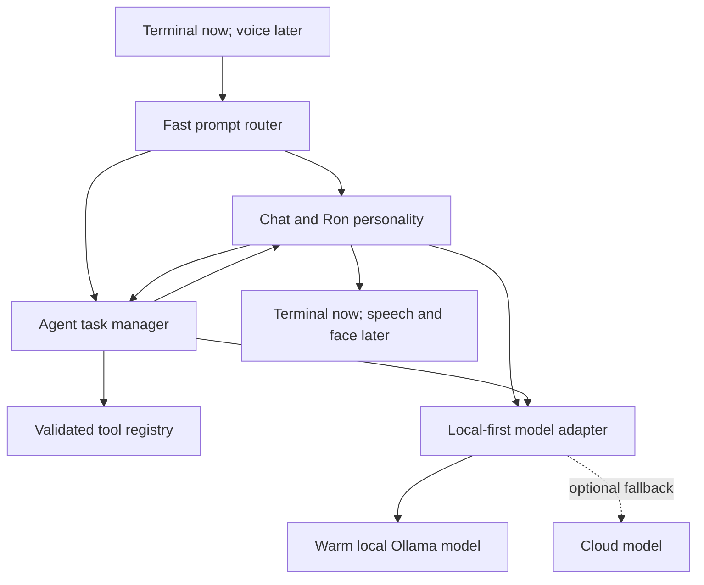

# Ron AI architecture

This document is the source of truth for Ron's brain. New AI features should
fit this design unless the design is deliberately revised first.

## Product rules

1. A user can type a normal prompt immediately. No wake phrase or mode command
   is required for text input.
2. `Start a chat` is an optional continuous-conversation mode. It keeps richer
   conversational context and, once voice exists, removes the need to repeat
   the wake word between turns.
3. Chat remains the user-facing personality. The agent is an internal worker;
   it returns progress and results through chat instead of becoming a second
   competing personality.
4. Offline operation is mandatory. Cloud models may improve difficult work
   later, but loss of internet must never make ordinary local use impossible.
5. Fast interaction is a feature, not an afterthought. Ron streams visible text,
   keeps the primary model warm, and gives live conversation priority over
   background agent planning.
6. The tablet face is an optional output adapter. Disconnecting or failing that
   adapter must never stop chat, tools, tasks, reminders, or local inference.

## System shape

## Prompt routing

Routing happens in three increasingly expensive layers:

1. Deterministic Python rules handle obvious conversation, obvious actions,
   mode commands, cancellation, and confirmation immediately.
2. A tiny classifier handles genuinely ambiguous prompts only.
3. The selected chat or agent service may reclassify a request when later
   context changes its meaning.

The router returns a typed decision with a destination, confidence, reason,
and whether confirmation is required. It never executes a tool itself.

## Interaction modes

| Mode | Entry | Context | Agent access |
| --- | --- | --- | --- |
| Ready | Program starts or chat ends | Short recent context | Yes |
| Continuous chat | `Start a chat` | Longer conversation context | Yes, through chat |
| Working | An agent task is active | Task state plus chat summary | Yes; chat stays responsive |
| Offline degraded | Local dependency fails | Last safe local state | No unsafe guessing |

An agent task does not lock the interface. The user can ask questions, request
status, cancel the task, or submit another prompt while work continues.

## Model policy

- Runtime: Ollama on `127.0.0.1` only.
- Initial model: `qwen3.5:4b`, selected for a practical first benchmark rather
  than assumed to be the permanent winner.
- Initial context: 8,192 tokens to control latency and memory use.
- Keep-alive: `-1` while Ron is active so follow-up prompts do not reload the
  model.
- Thinking: disabled for simple conversation and routing; enabled selectively
  only when harder planning benefits from it.
- Streaming: user-visible output begins as soon as the first content arrives.
- Optional upgrade: benchmark a larger local agent model only after the 4B
  baseline is measured on the actual computer.
- Cloud: opt-in adapter added later with a short timeout and automatic local
  fallback. Sensitive prompts stay local by policy.

## Agent safety

The model may request a named tool with typed arguments. It may not emit and
run unrestricted shell commands.

Every tool must define:

- an exact purpose and validated argument schema;
- a timeout, output-size limit, and cancellation behavior;
- whether the action is read-only, reversible, or destructive;
- whether user confirmation is required;
- a structured result that chat can explain to the user.

Before a multi-step task starts, the registry performs a complete preflight of
all steps. An unknown tool, invalid argument, missing integration or unmet
confirmation blocks the entire plan. Runtime failures stop the remaining
steps. A reversible tool may register a specific compensator and return the
exact prior state it needs. On later failure, timeout, or cancellation, those
registered compensators run in reverse order. Ron reports both successful and
failed rollback attempts and never claims an unregistered side effect was
undone.

One background worker runs at most four steps per task. Task state is retained
as queued, running, waiting, resolved, completed, failed, cancelled, or timed
out. Every handler receives a cancellation event, deadline, and output bound.
Cancellation is cooperative because terminating a system/API operation at an
arbitrary machine instruction can be less safe than stopping at a defined
checkpoint.

Task state is journalled locally. Queued or running work found after a restart
is marked failed and never resumed automatically, preventing duplicate
external actions. A clarification-only waiting task may be restored because it
has no running side effect.

External integrations are optional adapters. Spotify uses OAuth Authorization
Code with PKCE, a loopback callback, minimum playback scopes and Windows DPAPI
token protection. It receives no Spotify password and does not affect offline
operation when the internet or Spotify is unavailable.

Application control starts with a small allowlist. File operations are confined
to approved roots. Network monitoring begins read-only. Destructive actions,
credential access, purchases, messages, and security-sensitive changes require
explicit confirmation.

## Inference scheduling

One scheduler owns local-model requests so two systems do not overload the
computer independently. Priority is:

1. current user conversation;
2. routing clarification and agent progress summaries;
3. agent planning and tool-result analysis;
4. future memory indexing and other maintenance.

Long agent reasoning is split into bounded steps so it can yield between them.
The implemented scheduler serialises access to the local Ollama model and lets
waiting conversation run before waiting routing, planning, or maintenance.

## Delivery milestones

| Milestone | Deliverable | Status |
| --- | --- | --- |
| 0 | Local settings, streaming Ollama client, setup helper, real benchmark | Implemented |
| 1 | Immediate terminal chat with Ron's personality | Implemented |
| 2 | Deterministic-first chat/agent router | Implemented |
| 3 | Safe agent loop and initial application tools | Implemented |
| 4 | Multi-step tasks, preflight, progress, cancellation and Spotify adapter | Implemented |
| 4.1 | Deadlines, rollback, recovery, reminders, tools and diagnostics | Implemented |
| 5 | Optional cloud adapter with local fallback | Planned |
| Later | Memory, external drive, voice, wake word, recognition, monitoring | Planned |

Memory is intentionally postponed until chat, routing, and tools have stable
event schemas. Facial recognition, if added, requires explicit enrolment,
local biometric storage, confidence thresholds, and a non-recognition fallback.
